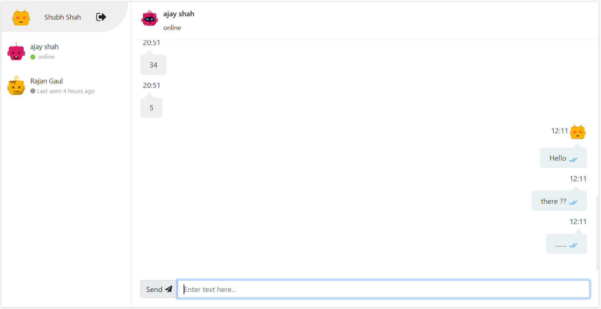
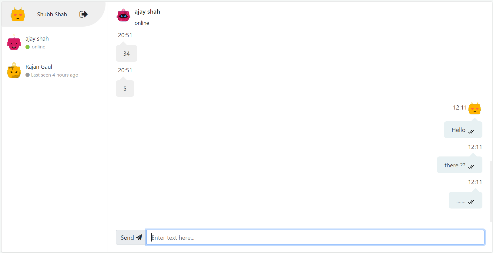

# Chat App

This is made as an Assignment for Dive.

Live deployed link - [https://chat-app-dive-assignment.web.app/](https://chat-app-dive-assignment.web.app/)

## Features

* Google Authentication using Firebase.
* One-to-One chatting.
* User Status (Online / Offline / Last Seen).
* Message Sent (Single tick acknowledgement when message is successfully sent).
* Message Delivered (Double tick when message is delivered to recipient).
* Message Read (Blue double tick when message is read by the recipient).

## Demo

<h4 align="center">When recipient has read the message (Blue double tick).</h4>

<h4 align="center">When message is delivered but not read by recipient (Double tick).</h4>

<h4 align="center">When message is delivered but recipient is offline (Single tick).</h4>

## Run project locally

* clone this Repository by `git clone https://github.com/shahshubh/chat-app-dive.git`.
* Change directory `cd chat-app-dive`
* Install the dependencies using `npm install`
* After the installation is complete, Run `npm run dev` to start the development server on `http://localhost:3000`.
